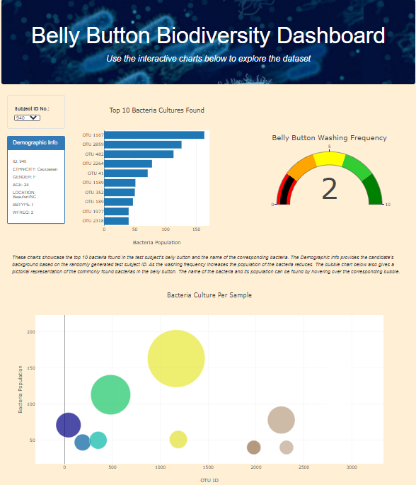

# Build an Interactive JavaScript Page to Display Charts and Statistics

## Overview and purpose
The projects explore some of the basic plots in JavaScript in the context of building an interactive display to showcase the biodiversity of bacteria present in a person's belly button. The rendered dashboard used Plotly.js, HTML and Bootstrap. 

## Resources
- VS Code
- Web browser Chrome
- Project data (`samples.json`)

## Summary
The dashboard provides the following charts:
- Bar Chart
  - The bar chart displays the top 10 Bacteria species found in the selected candidate's belly button. 
- Bubble Chart
    - The bubble chart displays the relative population of the bacteria found in the selected candidate's belly button. 
- Gauge Chart
    - The gauge chart displays the candidate's belly button washing frequency.

Based on the information in the dashboard the volunteers can identify if the bacterias found in their belly button fall in the family of bacteria that Improbable Beef has identified as the species that can synthesize good tasting beef. 

&nbsp

 
